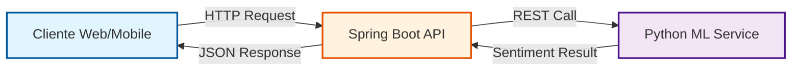
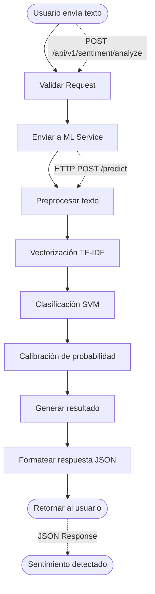
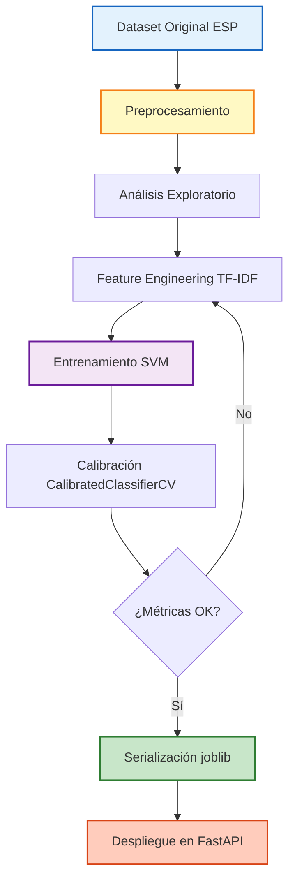

# SentimentAPI – Análisis de Sentimientos 🎭


> **Hackathon ONE | Proyecto de Análisis de Sentimientos**

API REST para análisis de sentimientos en textos en español, desarrollada mediante arquitectura de microservicios con Spring Boot y Machine Learning.

---

## 📋 Tabla de Contenidos

- [🚀 Descripción General](#-descripción-general)
- [🏗️ Arquitectura](#️-arquitectura)
- [🛠️ Tecnologías](#️-tecnologías)
- [📁 Estructura del Proyecto](#-estructura-del-proyecto)
- [⚙️ Requisitos Previos](#️-requisitos-previos)
- [🔧 Instalación y Configuración](#-instalación-y-configuración)
- [🎬 Demo](#-demo)
- [📄 Flujo de Análisis de Sentimientos](#-flujo-de-análisis-de-sentimientos)
- [📡 Endpoints Principales](#-endpoints-principales)
- [🔬 Pipeline de Data Science](#-pipeline-de-data-science)
- [📈 Performance del Modelo](#-performance-del-modelo)
- [📊 Datasets y Diccionario de Datos](#-datasets-y-diccionario-de-datos)
- [🧪 QA y Testing](#-qa-y-testing)
- [🎯 Características](#-características)
- [🚀 Roadmap](#-roadmap)
- [👥 Equipo](#-equipo)
- [📄 Licencia](#-licencia)
- [🤝 Contribuciones](#-contribuciones)

---

## 🚀 Descripción General

**SentimentAPI** es un sistema inteligente que analiza el sentimiento de textos clasificándolos en **positivo**, **negativo** o **neutro**. El proyecto integra un backend robusto en Java con un modelo de Machine Learning entrenado en Python, diseñado específicamente para procesar feedback de usuarios (reseñas, comentarios, encuestas).

### Objetivos del Proyecto
* ✅ **Backend robusto**: API REST escalable con Spring Boot
* ✅ **Microservicio ML**: Motor de predicción independiente con FastAPI
* ✅ **Pipeline NLP completo**: Desde datos crudos hasta predicciones calibradas
* ✅ **Análisis en tiempo real**: Respuestas rápidas con alta confianza
* ✅ **Interfaz web**: Aplicación frontend desplegada en Vercel

---

## �️ Arquitectura

El proyecto está dividido en tres componentes principales que se comunican mediante microservicios:



### Componentes

- **🌐 Backend (Spring Boot)**: API REST que expone endpoints y maneja la lógica de negocio
- **🤖 Model API (Python/FastAPI)**: Microservicio que ejecuta el modelo de ML entrenado con SVM calibrado
- **💻 Cliente Web**: Aplicación frontend desplegada en Vercel ([https://sentiment-ceron.vercel.app/](https://sentiment-ceron.vercel.app/))

**Tech Stack del Flujo:**
* **Entrada**: JSON con campo `text`
* **Motor ML**: `scikit-learn`, `joblib`, `pandas`
* **API**: `FastAPI` + `uvicorn`
* **Backend**: Spring Boot + RestClient
* **Salida**: Predicción (`positivo/neutral/negativo`) + probabilidad calibrada

---

## 🛠️ Tecnologías

### Backend
- **Java 17+**
- **Spring Boot 3.x**
- **Spring Web** - REST API
- **RestClient** - Comunicación con microservicio ML
- **Maven** - Gestión de dependencias

### Data Science & ML
- **Python 3.10+**
- **scikit-learn** - Modelo SVM con calibración de probabilidades
- **FastAPI** - Microservicio del modelo
- **Joblib** - Serialización del modelo
- **Pandas/NumPy** - Procesamiento de datos
- **TF-IDF** - Vectorización de texto (max_features=5000, ngram_range=(1,3))

### Frontend
- **React/TypeScript**
- **Vercel** - Hosting y deployment

---

## 📁 Estructura del Proyecto

```
sentiment-api/
├── src/main/java/              # Backend Spring Boot
│   ├── controller/             # Endpoints REST
│   ├── service/                # Lógica de negocio
│   ├── client/                 # Cliente HTTP para ML service
│   ├── dtos/                   # Objetos de transferencia
│   └── config/                 # Configuración
├── data-science/               # Pipeline de Data Science
│   ├── notebooks/              # Jupyter notebooks (entrenamiento)
│   │   └── Modelo_SentimentAPI.ipynb
│   ├── datasets/               # Dataset oficial
│   │   └── dataset_listo_para_ML_esp.csv
│   └── images/                 # Visualizaciones y evidencias
├── model-api/                  # Microservicio Python
│   ├── main.py                 # API FastAPI
│   ├── modelo_entrenado.joblib # Modelo serializado
│   └── requirements.txt        # Dependencias Python
├── docs/                       # Documentación
└── pom.xml                     # Maven config
```

---

## ⚙️ Requisitos Previos

- **JDK 17** o superior
- **Maven 3.6+**
- **Python 3.10+**
- **pip** (gestor de paquetes Python)

---

## 🔧 Instalación y Configuración

### 1. Clonar el repositorio
```bash
git clone https://github.com/ml-punto-tech/sentiment-api.git
cd sentiment-api
```

### 2. Configurar variables de entorno

Edita `src/main/resources/application.yaml`:
```yaml
# application-dev.yaml
model:
  api:
    url: http://localhost:8000  # URL del microservicio ML
```

### 3. Levantar el microservicio de ML

```bash
cd model-api
pip install -r requirements.txt
python main.py
# o con uvicorn:
uvicorn main:app --reload
```

El servicio ML estará disponible en `http://localhost:8000`

### 4. Ejecutar el Backend Spring Boot
```bash
# Desde la raíz del proyecto
mvn spring-boot:run
```

La API REST estará disponible en `http://localhost:8080`

### 5. (Opcional) Re-entrenar el modelo

Si necesitas entrenar el modelo desde cero:
```bash
cd data-science/notebooks
# Abrir y ejecutar Modelo_SentimentAPI.ipynb
# Esto generará modelo_entrenado.joblib
```
---

## 🎬 Demo

### Videos Demostrativos del Proyecto

Explora el funcionamiento completo de SentimentAPI a través de nuestros videos demostrativos:

#### 🔬 Demo Data Science
Conoce el proceso completo de desarrollo del modelo de Machine Learning, desde la preparación de datos hasta el entrenamiento y evaluación del modelo SVM.

📹 **[Ver Demo de Data Science](https://www.youtube.com/watch?v=6KPc_4aFbno&feature=youtu.be)**

**Contenido del video:**
- Análisis exploratorio del dataset
- Pipeline de preprocesamiento NLP
- Entrenamiento y optimización del modelo
- Métricas de evaluación y validación
- Serialización y deployment del modelo

---

#### 💻 Demo Backend
Descubre cómo funciona la API REST de SentimentAPI, sus endpoints y la integración con el microservicio de Machine Learning.

📹 **[Ver Demo de Backend](https://www.youtube.com/watch?v=6KPc_4aFbno&feature=youtu.be)**

**Contenido del video:**
- Arquitectura del sistema
- Endpoints principales (análisis individual y batch)
- Integración Backend ↔ ML Service
- Manejo de errores y validaciones
- Testing con Postman
- Deployment y configuración

---

### 🌐 Aplicación Web en Vivo

Prueba la aplicación directamente desde tu navegador:

🔗 **[https://sentiment-ceron.vercel.app/](https://sentiment-ceron.vercel.app/)**

**Características de la demo web:**
- ✅ Análisis de sentimientos en tiempo real
- ✅ Interfaz intuitiva y responsive
- ✅ Visualización de probabilidades
- ✅ Soporte para textos en español

---

## 📄 Flujo de Análisis de Sentimientos

### Proceso de Análisis Paso a Paso



### Ejemplo de Flujo Completo

**1. Request del Cliente**
```json
POST /api/v1/sentiment/analyze
Content-Type: application/json

{
  "text": "¡Me encanta este producto! Excelente calidad"
}
```

**2. Procesamiento Interno**
- ✅ Spring Boot API valida el request
- ✅ Envía el texto al servicio ML (Python/FastAPI)
- ✅ El modelo preprocesa: minúsculas, elimina puntuación, preserva negaciones
- ✅ Vectoriza con TF-IDF entrenado
- ✅ Clasifica con SVM (LinearSVC + CalibratedClassifierCV)
- ✅ Retorna predicción con probabilidad calibrada

**3. Response al Cliente**
```json
{
  "status": "success",
  "data": {
    "text": "¡Me encanta este producto! Excelente calidad",
    "sentiment": {
      "prevision": "positivo",
      "probabilidad": 0.92
    }
  },
  "timestamp": "2026-01-22T10:30:00"
}
```

---

## 📡 Endpoints Principales

### Analizar Sentimiento Individual

```http
POST /api/v1/sentiment/analyze
Content-Type: application/json

{
  "text": "Este producto es excelente, me encanta!"
}
```

**Respuesta exitosa (200):**
```json
{
  "status": "success",
  "data": {
    "text": "Este producto es excelente, me encanta!",
    "sentiment": {
      "prevision": "positivo",
      "probabilidad": 0.92
    }
  },
  "timestamp": "2026-01-22T10:30:00"
}
```

**Respuesta con error:**
```json
{
  "error": "El campo 'text' es obligatorio y debe tener al menos 3 caracteres."
}
```

### Analizar Múltiples Textos (Batch)

```http
POST /api/v1/sentiment/batch
Content-Type: multipart/form-data

file: archivo.csv
```

**Formato del CSV:**
```csv
"Este producto es increíble"
"El servicio fue terrible"
"La experiencia fue regular"
```

**Respuesta:**
```json
{
  "success": true,
  "data": {
    "totalProcessed": 3,
    "successful": 3,
    "failed": 0,
    "totalPositives": 1,
    "totalNeutrals": 1,
    "totalNegatives": 1,
    "results": [
      {
        "text": "Este producto es increíble",
        "sentiment": {
          "prevision": "positivo",
          "probabilidad": 0.95
        }
      },
      {
        "text": "El servicio fue terrible",
        "sentiment": {
          "prevision": "negativo",
          "probabilidad": 0.88
        }
      },
      {
        "text": "La experiencia fue regular",
        "sentiment": {
          "prevision": "neutral",
          "probabilidad": 0.76
        }
      }
    ]
  },
  "message": "Análisis completado exitosamente"
}
```

### Posibles valores de sentiment:
- `positivo` - Sentimiento positivo
- `negativo` - Sentimiento negativo
- `neutral` - Sentimiento neutro

---

## 🔬 Pipeline de Data Science



### Procesamiento de Texto

**Limpieza aplicada (resumen):**
- Conversión a minúsculas
- Eliminación de puntuación y caracteres especiales
- Eliminación de stopwords (lista manual)
- **Preservación de negaciones** (`no`, `ni`, `nunca`, etc.) para mantener polaridad

**Feature Engineering:**
- Vectorización: `TfidfVectorizer(max_features=5000, ngram_range=(1,3))`
- N-gramas de 1 a 3 palabras para capturar contexto

**Modelo Final:**
- Clasificador: `LinearSVC` (SVM lineal)
- Calibración: `CalibratedClassifierCV` para probabilidades confiables
- Split: 80/20 estratificado (`random_state=42`)
- Optimización: `GridSearchCV` sobre parámetro `C` con 5-fold CV

---

## 📈 Performance del Modelo

### Métricas Generales (Test Set 20%)

| Métrica | Valor | Descripción |
|---------|-------|-------------|
| **Accuracy** | 82.78% | Precisión general del modelo |
| **F1-Score Macro** | 0.83 | Balance entre precisión y recall |
| **Dataset Size** | ~3,240 muestras | Textos en español |

### Métricas por Clase

| Sentimiento | Precision | Recall | F1-Score | Interpretación |
|-------------|-----------|--------|----------|----------------|
| 😊 **Positivo** | 0.85 | 0.93 | 0.89 | Excelente detección de casos positivos |
| 😐 **Neutral** | 0.80 | 0.80 | 0.80 | Balance sólido |
| 😢 **Negativo** | 0.84 | 0.75 | 0.79 | Buena precisión, recall mejorable |

### Matriz de Confusión

El modelo muestra confusiones típicas entre neutral y los extremos (positivo/negativo), lo cual es esperado dado que el lenguaje natural contiene ambigüedades.

**Distribución de Clases (Dataset Final):**
- Negativo: 32.20%
- Positivo: 34.70%
- Neutral: 33.10%

> 💡 **Nota**: Dataset relativamente balanceado. Se detectaron 424 duplicados (12.96%) que fueron conservados para reforzar frases comunes.

---

## 📊 Datasets y Diccionario de Datos

### Dataset Oficial: `dataset_listo_para_ML_esp.csv`

**Origen**: Dataset propio construido por el equipo (Hackathon ONE)  
**Idioma**: Español  
**Tamaño**: ~3,240 registros

**Columnas**

| Variable | Tipo | Descripción |
| :--- | :--- | :--- |
| `texto` | String | Texto crudo en español (input del modelo) |
| `sentimiento` | String | Target con 3 clases: `positivo`, `neutral`, `negativo` |

**Calidad del Dataset:**
- ✅ Nulos en `texto`: 0
- ✅ Nulos en `sentimiento`: 0
- ✅ Etiquetas inválidas: 0
- ⚠️ Duplicados: 424 (12.96%) - conservados intencionalmente
- ✅ Encoding: UTF-8 (resuelto problema de mojibake durante migración desde Excel)

---

## 🧪 QA y Testing

### Testing de Datos (ETL)

**Validaciones aplicadas:**
* ✅ **Integridad**: 0 nulos en columnas críticas
* ✅ **Consistencia**: Etiquetas en minúscula (`positivo`, `neutral`, `negativo`)
* ✅ **Encoding**: Normalización UTF-8 (problema resuelto: mojibake en Excel→CSV)
* ⚠️ **Duplicados**: 424 detectados (12.96%) - decisión: conservar para reforzar frases comunes

### Testing de Machine Learning

**Configuración de Evaluación:**
- Split estratificado 80/20 (`random_state=42`)
- Optimización: `GridSearchCV` sobre parámetro `C`
- Validación: 5-fold cross-validation
- Métrica principal: Accuracy

**Resultados (Holdout 20%):**
- Accuracy: **82.78%**
- F1-Score Positivo: **0.89**
- F1-Score Neutral: **0.80**
- F1-Score Negativo: **0.79**

**Problemas Resueltos:**
1. **Encoding corrupto**: Migración Excel→CSV con normalización UTF-8
2. **Desbalance inicial**: Estratificación del split para mantener distribución
3. **Probabilidades no calibradas**: Implementación de `CalibratedClassifierCV`

### Evidencia Visual

📸 **Proceso completo**: Del caos al modelo funcional  
📊 **Distribución de clases**: Relativamente balanceado  
📈 **Matriz de confusión**: Confusiones típicas entre neutral y extremos  
🧹 **Análisis de limpieza**: Registros eliminados vs conservados

> Para más detalles técnicos, consulta: `data-science/notebooks/Modelo_SentimentAPI.ipynb`

---

## 🎯 Características

- ✅ Análisis de sentimiento en tiempo real
- ✅ Soporte nativo para textos en español
- ✅ Análisis individual y por lotes (batch)
- ✅ Puntuación de confianza calibrada (probabilidad)
- ✅ Arquitectura de microservicios escalable
- ✅ Manejo robusto de errores
- ✅ CORS configurado para frontend
- ✅ Perfiles de configuración (dev/prod)
- ✅ API documentada
- ✅ Interfaz web responsive en Vercel
- ✅ Pipeline ML reproducible (seed=42)
- ✅ Preservación de negaciones en preprocesamiento

---

## 🚀 Roadmap

### Versión 1.0 (Actual - MVP) ✅
- ✅ Análisis de sentimiento básico (Positivo/Negativo/Neutro)
- ✅ API REST funcional con Spring Boot
- ✅ Microservicio de ML independiente (FastAPI)
- ✅ Soporte para español
- ✅ Interfaz web en Vercel
- ✅ Análisis por lotes (CSV)
- ✅ Modelo SVM calibrado con probabilidades

### Versión 2.0 (Q1 2026)
- [ ] **Análisis de emociones específicas**: Detectar alegría, tristeza, enojo, miedo, sorpresa
- [ ] **Soporte multiidioma**: Inglés, portugués
- [ ] **Análisis de aspectos**: Identificar características específicas mencionadas
- [ ] **Sistema de caché**: Redis para respuestas más rápidas
- [ ] **Autenticación**: JWT para acceso seguro a la API
- [ ] **Rate limiting**: Control de uso por usuario/API key
- [ ] **Métricas de monitoreo**: Prometheus + Grafana

### Versión 3.0 (Q2 2026)
- [ ] **Dashboard de analytics**: Visualización de tendencias y estadísticas
- [ ] **Webhook notifications**: Alertas en tiempo real
- [ ] **API de streaming**: Análisis en tiempo real de flujos de texto
- [ ] **Detección de sarcasmo**: Mejora en la comprensión contextual
- [ ] **Fine-tuning personalizado**: Entrenar modelos con datos propios del cliente
- [ ] **Exportación de reportes**: PDF, Excel con análisis completos

### Futuro
- [ ] **Integración con redes sociales**: Twitter/X, Instagram, Facebook
- [ ] **Análisis de audio**: Transcripción y análisis de sentimientos en voz
- [ ] **Mobile SDK**: Librerías nativas para iOS y Android
- [ ] **Modelos transformer**: BERT/GPT para mayor precisión
- [ ] **Marketplace de modelos**: Modelos especializados por industria
- [ ] **Análisis de imágenes**: Detección de sentimientos en memes e imágenes con texto

> 💡 **¿Tienes una idea?** Abre un [issue](https://github.com/ml-punto-tech/sentiment-api/issues) o contacta al equipo.

---

## 👥 Equipo

### Backend Team

| Rol | Miembro | Responsabilidades Clave |
| :--- | :--- | :--- |
| **Líder Coordinador de Backend y Frontend** | Denis Díaz | 🤝 Coordinación de equipos y asignación de tareas<br>🎤 Sprint Demo y presentación como Product Owner<br>📖 Documentación general y flujogramas del sistema |
| **Tech Lead / Arquitecto Backend** | Wilmar Zapata | 🏗️ Configuración del proyecto Spring Boot<br>🧠 Implementación de SentimentService y lógica de negocio<br>🎯 Liderazgo técnico y code reviews |
| **Desarrollador Principal / API & Integration** | Adrián Luna | 📡 Implementación de SentimentController y endpoints REST<br>🔌 Integración con Data Science (DataScienceClient)<br>📦 Diseño de DTOs y modelos con validación |
| **QA / Testing / Documentación Técnica** | Carlos Chávez (Cerón) | 📮 Testing completo con Postman y QA<br>📖 Documentación técnica del backend<br>🛡️ Exception Handling y sistema de logs |

### Data Science Team

| Rol | Miembro | Responsabilidades Clave |
| :--- | :--- | :--- |
| **Líder de Integración (Java/DS)** | Eduardo | Coordinación backend-ML y definición del contrato JSON |
| **Especialista NLP** | Marely | Pipeline de procesamiento de texto y limpieza de datos |
| **Científico/a de ML** | Alex | Entrenamiento, evaluación y optimización del modelo SVM |
| **Data QA & Documentation** | Agustin | Testing de datos, validación de calidad y documentación DS |

### Contacto
- 📧 Email: [contacto@sentiment-api.com](mailto:contacto@sentiment-api.com)
- 🔗 GitHub: [@ml-punto-tech](https://github.com/ml-punto-tech)
- 🌐 Web: [https://sentiment-ceron.vercel.app/](https://sentiment-ceron.vercel.app/)

---

## 📄 Licencia

Este proyecto está disponible bajo la licencia MIT. Ver el archivo [LICENSE](LICENSE) para más detalles.

---

## 🤝 Contribuciones

Las contribuciones son bienvenidas y apreciadas. Para contribuir:

1. **Fork** el proyecto
2. Crea una rama para tu feature (`git checkout -b feature/AmazingFeature`)
3. **Commit** tus cambios (`git commit -m 'Add some AmazingFeature'`)
4. **Push** a la rama (`git push origin feature/AmazingFeature`)
5. Abre un **Pull Request**

### Guías de Contribución

- Sigue las convenciones de código del proyecto (Java + Python)
- Añade tests para nuevas funcionalidades
- Actualiza la documentación según sea necesario
- Describe claramente los cambios en el PR
- Para cambios en el modelo ML, documenta métricas de evaluación

### Reportar Bugs

Si encuentras un bug, abre un [issue](https://github.com/ml-punto-tech/sentiment-api/issues) incluyendo:
- Descripción del problema
- Pasos para reproducirlo
- Comportamiento esperado vs actual
- Logs relevantes (backend o ML service)
- Screenshots si es aplicable

---

<div align="center">

⭐ Si te ha gustado este proyecto, ¡dale una estrella!

**Made with ❤️ by ML Punto Tech Team**

[Documentación](https://github.com/ml-punto-tech/sentiment-api/wiki) • [Issues](https://github.com/ml-punto-tech/sentiment-api/issues) • [Demo](https://sentiment-ceron.vercel.app/)

---

**Fecha de última actualización**: 2026-01-22  
**Versión**: 1.0.0 (MVP)

</div>
