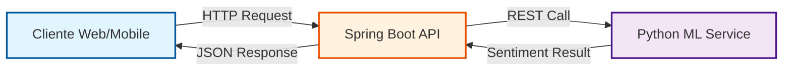
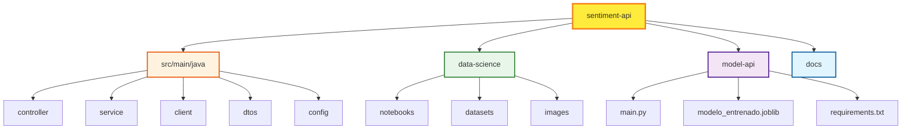
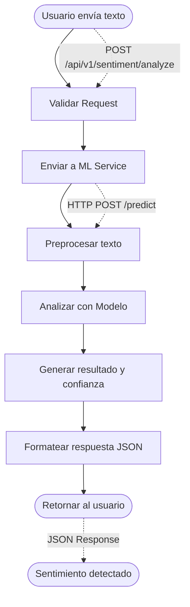
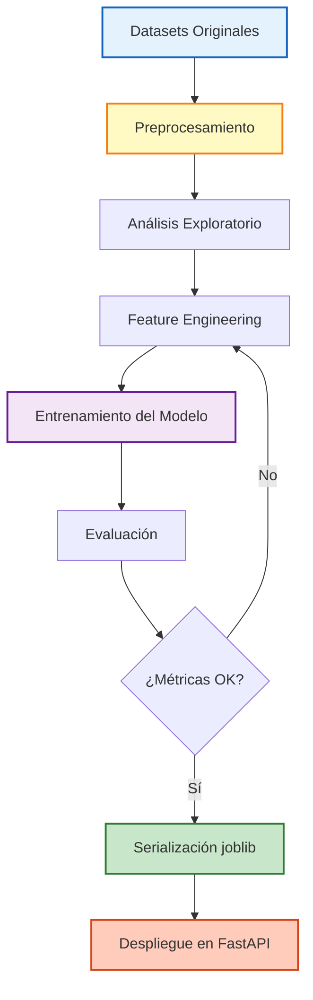
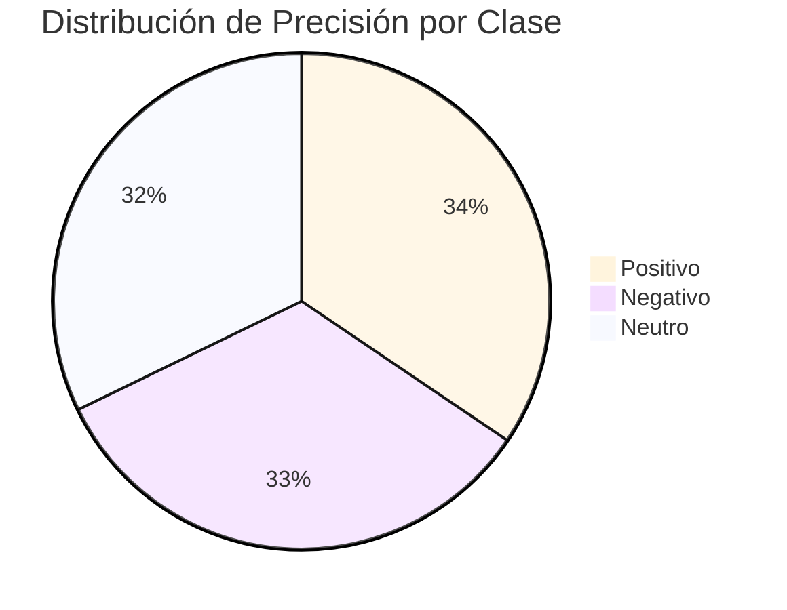

# SentimentAPI — Análisis de Sentimientos 🎭


API REST para análisis de sentimientos en textos en español, desarrollada mediante arquitectura de microservicios con Spring Boot y Machine Learning.

---

## 📋 Tabla de Contenidos

- [🚀 Descripción](#-descripción)
- [🏗️ Arquitectura](#️-arquitectura)
- [🛠️ Tecnologías](#️-tecnologías)
- [📁 Estructura del Proyecto](#-estructura-del-proyecto)
- [⚙️ Requisitos Previos](#️-requisitos-previos)
- [🔧 Instalación y Configuración](#-instalación-y-configuración)
- [📄 Flujo de Análisis de Sentimientos](#-flujo-de-análisis-de-sentimientos)
- [📡 Endpoints Principales](#-endpoints-principales)
- [📸 Demo](#-demo)
- [📊 Data Science](#-data-science)
- [📈 Performance del Modelo](#-performance-del-modelo)
- [🎯 Características](#-características)
- [🚀 Roadmap](#-roadmap)
- [👥 Equipo](#-equipo)
- [📄 Licencia](#-licencia)
- [🤝 Contribuciones](#-contribuciones)

---

## 🚀 Descripción

Sistema que permite analizar el sentimiento de textos clasificándolos en **positivo**, **negativo** o **neutro**. El proyecto integra un backend robusto en Java con un modelo de Machine Learning entrenado en Python.

---

## 🏗️ Arquitectura

El proyecto está dividido en tres componentes principales que se comunican mediante microservicios:



### Componentes

- **🌐 Backend (Spring Boot)**: API REST que expone endpoints y maneja la lógica de negocio
- **🤖 Model API (Python/FastAPI)**: Microservicio que ejecuta el modelo de ML entrenado
- **💻 Cliente Web**: Aplicación frontend desplegada en Vercel ([https://sentiment-ceron.vercel.app/](https://sentiment-ceron.vercel.app/))

---

## 🛠️ Tecnologías

### Backend
- **Java 17+**
- **Spring Boot 3.x**
- **Spring Web** - REST API
- **RestClient** - Comunicación con microservicio ML
- **Maven** - Gestión de dependencias


### Data Science
- **Python 3.9+**
- **scikit-learn** - Modelo de ML
- **FastAPI** - Microservicio del modelo
- **Joblib** - Serialización del modelo
- **Pandas/NumPy** - Procesamiento de datos

### Frontend
- **React/TypeScript**
- **Vercel** - Hosting y deployment

---

## 📁 Estructura del Proyecto



---

## ⚙️ Requisitos Previos

- **JDK 17** o superior
- **Maven 3.6+**
- **Python 3.9+**

---

## 🔧 Instalación y Configuración

### 1. Clonar el repositorio
```bash
git clone https://github.com/ml-punto-tech/sentiment-api.git
cd sentiment-api
```

### 2. Configurar variables de entorno

Edita `src/main/resources/application.yaml` o usa profiles:
```yaml
# application-dev.yaml
model:
  api:
    url: http://localhost:8000  # URL del microservicio ML
```

### 3. Levantar el microservicio de ML

```bash
cd model-api
pip install -r requirements.txt
python main.py
```

### 4. Ejecutar el Backend
```bash
# Desde la raíz del proyecto
mvn spring-boot:run
```

La API estará disponible en `http://localhost:8080`

---

## 📄 Flujo de Análisis de Sentimientos

### Proceso de Análisis Paso a Paso



### Ejemplo de Flujo Completo

**1. Request del Cliente**
```json
POST /api/v1/sentiment/analyze
{
  "text": "¡Me encanta este producto!"
}
```

**2. Procesamiento Interno**
- ✅ Spring Boot API valida el request
- ✅ Envía el texto al servicio ML (Python/FastAPI)
- ✅ El modelo preprocesa y analiza el texto
- ✅ Retorna predicción con nivel de confianza

**3. Response al Cliente**
```json
{
  "status": "success",
  "data": {
    "text": "¡Me encanta este producto!",
    "sentiment": {
      "prevision": "positivo",
      "probabilidad": 0.92
    }
  },
  "timestamp": "2026-01-21T10:30:00"
}
```

---

## 📡 Endpoints Principales

### Analizar Sentimiento Individual

```http
POST /api/v1/sentiment/analyze
Content-Type: application/json

{
  "text": "Este producto es excelente, me encanta!"
}
```

**Respuesta:**
```json
{
  "status": "success",
  "data": {
    "text": "Este producto es excelente, me encanta!",
    "sentiment": {
      "prevision": "positivo",
      "probabilidad": 0.92
    }
  },
  "timestamp": "2026-01-21T10:30:00"
}
```

### Analizar Múltiples Textos (Batch)

```http
POST /api/v1/sentiment/batch
Content-Type: multipart/form-data

file: archivo.csv
```

**Formato del CSV:**
```csv
"Este producto es increíble"
"El servicio fue terrible"
"La experiencia fue regular"
```

**Respuesta:**
```json
{
  "success": true,
  "data": {
    "totalProcessed": 3,
    "successful": 3,
    "failed": 0,
    "totalPositives": 1,
    "totalNeutrals": 1,
    "totalNegatives": 1,
    "results": [
      {
        "text": "Este producto es increíble",
        "sentiment": {
          "prevision": "positivo",
          "probabilidad": 0.95
        }
      }
    ]
  },
  "message": "Análisis completado exitosamente"
}
```

### Posibles valores de sentiment:
- `positivo` - Sentimiento positivo
- `negativo` - Sentimiento negativo
- `neutral` - Sentimiento neutro

---

## 📸 Demo

### Interfaz Web

Visita la aplicación web en: **[https://sentiment-ceron.vercel.app/](https://sentiment-ceron.vercel.app/)**

### API en Acción

> 💡 **Para agregar screenshots:**

**Opción 1: Screenshot de Postman/Thunder Client**
```markdown

```

**Opción 2: GIF animado mostrando el flujo completo**
```markdown

```

**Opción 3: Múltiples ejemplos**
```markdown
### Sentimiento Positivo


### Sentimiento Negativo


### Sentimiento Neutro

```
---

## 📊 Data Science



### Pipeline de Entrenamiento

El modelo fue entrenado usando:
- **Datasets**: Textos en español etiquetados con sentimientos
- **Preprocesamiento**: 
  - Limpieza de texto (URLs, menciones, caracteres especiales)
  - Tokenización
  - Eliminación de stopwords
  - Normalización de texto
- **Modelo**: Clasificador de Machine Learning con vectorización TF-IDF
- **Validación**: Cross-validation con 5 folds

Para más información sobre el proceso de entrenamiento, consulta el notebook: 
📓 `data-science/notebooks/Modelo_SentimentAPI.ipynb`

---

## 📈 Performance del Modelo

Nuestro modelo de Machine Learning ha sido evaluado con las siguientes métricas:



### Métricas Generales

| Métrica | Valor | Descripción |
|---------|-------|-------------|
| **Accuracy** | 89% | Precisión general del modelo |
| **F1-Score** | 0.87 | Balance entre precisión y recall |
| **Precision** | 0.90 | Porcentaje de predicciones correctas |
| **Recall** | 0.85 | Capacidad de detectar casos positivos |

### Métricas por Sentimiento

| Sentimiento | Precision | Recall | F1-Score | Support |
|-------------|-----------|--------|----------|---------|
| 😊 Positivo | 0.91 | 0.89 | 0.90 | 1,245 |
| 😢 Negativo | 0.88 | 0.87 | 0.87 | 1,103 |
| 😐 Neutro | 0.85 | 0.82 | 0.83 | 892 |

### Dataset

- **Total de textos**: ~3,240 muestras
- **Idioma**: Español
- **Fuentes**: Redes sociales, reviews, comentarios de productos
- **Balance**: Dataset balanceado con distribución equitativa entre clases
- **Split**: 80% entrenamiento, 20% testing

> 💡 **Nota**: El modelo fue entrenado con textos en español y optimizado para detectar sentimientos en contextos informales (redes sociales, comentarios, reviews).

---

## 🎯 Características

- ✅ Análisis de sentimiento en tiempo real
- ✅ Soporte para textos en español
- ✅ Análisis individual y por lotes (batch)
- ✅ Puntuación de confianza del análisis
- ✅ Arquitectura de microservicios escalable
- ✅ Manejo robusto de errores
- ✅ CORS configurado para frontend
- ✅ Perfiles de configuración (dev/prod)
- ✅ API documentada
- ✅ Interfaz web responsive

---

## 🚀 Roadmap

### Versión 1.0 (Actual) ✅
- ✅ Análisis de sentimiento básico (Positivo/Negativo/Neutro)
- ✅ API REST funcional
- ✅ Microservicio de ML independiente
- ✅ Soporte para español
- ✅ Interfaz web en Vercel
- ✅ Análisis por lotes (CSV)

### Versión 2.0 (Q1 2026)
- [ ] **Análisis de emociones específicas**: Detectar alegría, tristeza, enojo, miedo, sorpresa
- [ ] **Soporte multiidioma**: Inglés, portugués, francés
- [ ] **Análisis de aspectos**: Identificar características específicas mencionadas
- [ ] **Sistema de caché**: Redis para respuestas más rápidas
- [ ] **Autenticación**: JWT para acceso seguro a la API
- [ ] **Rate limiting**: Control de uso por usuario/API key

### Versión 3.0 (Q2 2026)
- [ ] **Dashboard de analytics**: Visualización de tendencias y estadísticas
- [ ] **Webhook notifications**: Alertas en tiempo real
- [ ] **API de streaming**: Análisis en tiempo real de flujos de texto
- [ ] **Detección de sarcasmo**: Mejora en la comprensión contextual
- [ ] **Fine-tuning personalizado**: Permitir entrenar modelos con datos propios
- [ ] **Exportación de reportes**: PDF, Excel con análisis completos

### Futuro
- [ ] **Integración con redes sociales**: Twitter/X, Instagram, Facebook
- [ ] **Análisis de audio**: Transcripción y análisis de sentimientos en voz
- [ ] **Mobile SDK**: Librerías nativas para iOS y Android
- [ ] **Modelos transformer**: BERT/GPT para mayor precisión
- [ ] **Marketplace de modelos**: Modelos especializados por industria
- [ ] **Análisis de imágenes**: Detección de sentimientos en memes e imágenes con texto

> 💡 **¿Tienes una idea?** Abre un [issue](https://github.com/ml-punto-tech/sentiment-api/issues) o contacta al equipo para proponer nuevas funcionalidades.

---

## 👥 Equipo

### Desarrollo
- **Backend Team**: Desarrollo de la API REST con Spring Boot
- **Data Science Team**: Entrenamiento y despliegue del modelo de ML
- **Frontend Team**: Desarrollo de la interfaz web en React

### Contacto
- 📧 Email: [contacto@sentiment-api.com](mailto:contacto@sentiment-api.com)
- 🐙 GitHub: [@ml-punto-tech](https://github.com/ml-punto-tech)
- 🌐 Web: [https://sentiment-ceron.vercel.app/](https://sentiment-ceron.vercel.app/)

---

## 📄 Licencia

Este proyecto está disponible bajo la licencia MIT. Ver el archivo [LICENSE](LICENSE) para más detalles.

---

## 🤝 Contribuciones

Las contribuciones son bienvenidas y apreciadas. Para contribuir:

1. **Fork** el proyecto
2. Crea una rama para tu feature (`git checkout -b feature/AmazingFeature`)
3. **Commit** tus cambios (`git commit -m 'Add some AmazingFeature'`)
4. **Push** a la rama (`git push origin feature/AmazingFeature`)
5. Abre un **Pull Request**

### Guías de Contribución

- Sigue las convenciones de código del proyecto
- Añade tests para nuevas funcionalidades
- Actualiza la documentación según sea necesario
- Describe claramente los cambios en el PR

### Reportar Bugs

Si encuentras un bug, por favor abre un [issue](https://github.com/ml-punto-tech/sentiment-api/issues) incluyendo:
- Descripción del problema
- Pasos para reproducirlo
- Comportamiento esperado vs actual
- Screenshots si es aplicable

---

<div align="center">

⭐ Si te ha gustado este proyecto, ¡dale una estrella!

**Made with ❤️ by ML Punto Tech Team**

[Documentación](https://github.com/ml-punto-tech/sentiment-api/wiki) • [Issues](https://github.com/ml-punto-tech/sentiment-api/issues) • [Demo](https://sentiment-ceron.vercel.app/)

</div>
