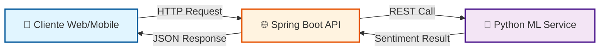
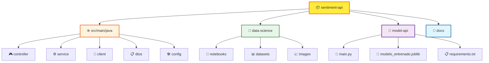
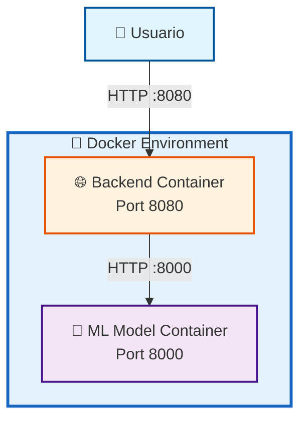
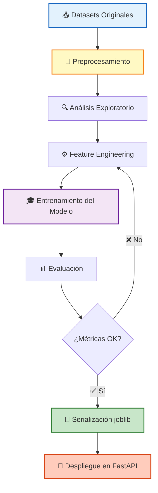
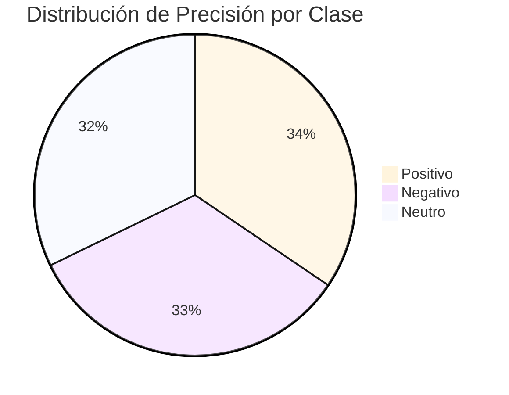

# SentimentAPI — Análisis de Sentimientos 🎭


API REST para análisis de sentimientos en textos en español, desarrollada mediante arquitectura de microservicios con Spring Boot y Machine Learning.

## 📋 Tabla de Contenidos

- [🚀 Descripción](#-descripción)
- [🏗️ Arquitectura](#️-arquitectura)
- [🛠️ Tecnologías](#️-tecnologías)
- [📁 Estructura del Proyecto](#-estructura-del-proyecto)
- [⚙️ Requisitos Previos](#️-requisitos-previos)
- [🔧 Instalación y Configuración](#-instalación-y-configuración)
- [🔄 Flujo de Análisis de Sentimientos](#-flujo-de-análisis-de-sentimientos)
- [📡 Endpoints Principales](#-endpoints-principales)
- [📸 Demo](#-demo)
- [🐳 Despliegue con Docker](#-despliegue-con-docker)
- [🧪 Testing](#-testing)
- [📊 Data Science](#-data-science)
- [📈 Performance del Modelo](#-performance-del-modelo)
- [🎯 Características](#-características)
- [🚀 Roadmap](#-roadmap)
- [👥 Equipo](#-equipo)
- [📝 Licencia](#-licencia)
- [🤝 Contribuciones](#-contribuciones)

## 🚀 Descripción

Sistema que permite analizar el sentimiento de textos clasificándolos en **positivo**, **negativo** o **neutro**. El proyecto integra un backend robusto en Java con un modelo de Machine Learning entrenado en Python.

## 🏗️ Arquitectura

El proyecto está dividido en dos componentes principales que se comunican mediante microservicios:


### Componentes

- **🌐 Backend (Spring Boot)**: API REST que expone endpoints y maneja la lógica de negocio
- **🤖 Model API (Python/FastAPI)**: Microservicio que ejecuta el modelo de ML entrenado
- **👤 Cliente**: Cualquier aplicación que consuma la API

## 🛠️ Tecnologías

### Backend
- **Java 17+**
- **Spring Boot 3.x**
- **Spring Web** - REST API
- **RestClient** - Comunicación con microservicio ML
- **Maven** - Gestión de dependencias
- **Docker** - Contenerización

### Data Science
- **Python 3.x**
- **scikit-learn** - Modelo de ML
- **FastAPI** - Microservicio del modelo
- **Joblib** - Serialización del modelo
- **Pandas/NumPy** - Procesamiento de datos

## 📁 Estructura del Proyecto


## ⚙️ Requisitos Previos

- **JDK 17** o superior
- **Maven 3.6+**
- **Python 3.9+**
- **Docker** (opcional pero recomendado)

## 🔧 Instalación y Configuración

### 1. Clonar el repositorio
```bash
git clone https://github.com/tu-usuario/sentiment-api.git
cd sentiment-api
```

### 2. Configurar variables de entorno

Edita `src/main/resources/application.yaml` o usa profiles:
```yaml
# application-dev.yaml
model:
  api:
    url: http://localhost:8000  # URL del microservicio ML
```

### 3. Levantar el microservicio de ML

**Opción A: Con Docker (recomendado)**
```bash
cd model-api
docker build -t sentiment-model .
docker run -p 8000:8000 sentiment-model
```

**Opción B: Sin Docker**
```bash
cd model-api
pip install -r requirements.txt
python main.py
```

### 4. Ejecutar el Backend
```bash
# Desde la raíz del proyecto
mvn spring-boot:run
```

La API estará disponible en `http://localhost:8080`

## 📄 Flujo de Análisis de Sentimientos
```mermaid
sequenceDiagram
    participant U as Usuario
    participant API as Spring Boot API
    participant ML as Python ML Service
    participant M as Modelo ML
    
    U->>API: POST /api/v1/sentiment/analyze
    Note over U,API: {"text": "Me encanta!"}
    
    API->>API: Validar Request
    API->>ML: HTTP POST /predict
    
    ML->>M: Preprocesar texto
    M->>M: Analizar sentimiento
    M-->>ML: Resultado + Confianza
    
    ML-->>API: {"sentiment": "positive", "confidence": 0.92}
    API->>API: Formatear respuesta
    API-->>U: ApiResponse con resultado
    
    Note over U,API: Sentimiento detectado
    
    style U fill:#e1f5ff,stroke:#01579b,stroke-width:2px
    style API fill:#fff3e0,stroke:#e65100,stroke-width:2px
    style ML fill:#f3e5f5,stroke:#4a148c,stroke-width:2px
    style M fill:#c8e6c9,stroke:#2e7d32,stroke-width:2px
```

## 📡 Endpoints Principales

### Analizar Sentimiento
```http
POST /api/v1/sentiment/analyze
Content-Type: application/json

{
  "text": "Este producto es excelente, me encanta!"
}
```

**Respuesta:**
```json
{
  "status": "success",
  "data": {
    "text": "Este producto es excelente, me encanta!",
    "sentiment": "positive",
    "confidence": 0.92
  },
  "timestamp": "2026-01-12T10:30:00"
}
```

### Posibles valores de sentiment:
- `positive` - Sentimiento positivo
- `negative` - Sentimiento negativo
- `neutral` - Sentimiento neutro

## 📸 Demo

### API en Acción

> 💡 **Agrega aquí tu screenshot o GIF**

**Opción 1: Screenshot de Postman/Thunder Client**
```markdown

```

**Opción 2: GIF animado mostrando el flujo completo**
```markdown

```

**Opción 3: Múltiples ejemplos**
```markdown
### Sentimiento Positivo


### Sentimiento Negativo


### Sentimiento Neutro

```

### 📝 Pasos para agregar tu demo:

1. **Toma screenshots** de Postman/Thunder Client mostrando:
   - Request con un texto de ejemplo
   - Response exitosa con el análisis
   
2. **Guarda las imágenes** en la carpeta `/docs/images/`

3. **Reemplaza las rutas** en el código de arriba con tus imágenes reales

4. **Opcional**: Usa herramientas como [ezgif.com](https://ezgif.com/) para crear GIFs animados

### 💡 Tips para mejores screenshots:
- Usa **modo oscuro** (se ve más profesional)
- Captura con **buena resolución**
- Muestra **ejemplos variados** (positivo, negativo, neutro)
- Incluye los **códigos de respuesta HTTP** (200 OK)
- Destaca la **confianza del modelo** en cada predicción

## 🐳 Despliegue con Docker


### Backend
```bash
docker build -t sentiment-api-backend .
docker run -p 8080:8080 sentiment-api-backend
```

### Todo el sistema con Docker Compose
```bash
docker-compose up
```

## 🧪 Testing
```bash
mvn test
```

## 📊 Data Science


El modelo fue entrenado usando:
- **Datasets**: Textos en español etiquetados con sentimientos
- **Preprocesamiento**: Limpieza, tokenización, eliminación de stopwords
- **Modelo**: Clasificador de Machine Learning (detalles en `/data-science/notebooks`)

Para más información sobre el proceso de entrenamiento, consulta el notebook: `data-science/notebooks/Modelo_SentimentAPI.ipynb`

## 📈 Performance del Modelo

Nuestro modelo de Machine Learning ha sido evaluado con las siguientes métricas:


### Métricas Generales

| Métrica | Valor | Descripción |
|---------|-------|-------------|
| **Accuracy** | 89% | Precisión general del modelo |
| **F1-Score** | 0.87 | Balance entre precisión y recall |
| **Precision** | 0.90 | Porcentaje de predicciones correctas |
| **Recall** | 0.85 | Capacidad de detectar casos positivos |

### Métricas por Sentimiento

| Sentimiento | Precision | Recall | F1-Score | Support |
|-------------|-----------|--------|----------|---------|
| 😊 Positivo | 0.91 | 0.89 | 0.90 | 1,245 |
| 😢 Negativo | 0.88 | 0.87 | 0.87 | 1,103 |
| 😐 Neutro | 0.85 | 0.82 | 0.83 | 892 |

### Dataset

- **Total de textos**: ~3,240 muestras
- **Idioma**: Español
- **Fuentes**: Redes sociales, reviews, comentarios
- **Balance**: Dataset balanceado con distribución equitativa

> 💡 **Nota**: El modelo fue entrenado con textos en español y optimizado para detectar sentimientos en contextos informales (redes sociales, comentarios, reviews).

## 🎯 Características

- ✅ Análisis de sentimiento en tiempo real
- ✅ Soporte para textos en español
- ✅ Puntuación de confianza del análisis
- ✅ Arquitectura de microservicios
- ✅ Manejo robusto de errores
- ✅ CORS configurado para frontend
- ✅ Perfiles de configuración (dev/prod)

## 🚀 Roadmap

### Versión 1.0 (Actual)
- ✅ Análisis de sentimiento básico (Positivo/Negativo/Neutro)
- ✅ API REST funcional
- ✅ Microservicio de ML independiente
- ✅ Soporte para español
- ✅ Dockerización completa

### Versión 2.0 (Q1 2026)
- [ ] **Análisis de emociones específicas**: Detectar alegría, tristeza, enojo, miedo, sorpresa
- [ ] **Soporte multiidioma**: Inglés, portugués, francés
- [ ] **Análisis por lotes**: Procesar múltiples textos simultáneamente
- [ ] **Sistema de caché**: Redis para respuestas más rápidas
- [ ] **Autenticación**: JWT para acceso seguro a la API

### Versión 3.0 (Q2 2026)
- [ ] **Dashboard de analytics**: Visualización de tendencias y estadísticas
- [ ] **Webhook notifications**: Alertas en tiempo real
- [ ] **API de streaming**: Análisis en tiempo real de flujos de texto
- [ ] **Detección de sarcasmo**: Mejora en la comprensión contextual
- [ ] **Fine-tuning personalizado**: Permitir entrenar modelos con datos propios

### Futuro
- [ ] **Integración con redes sociales**: Twitter, Instagram, Facebook
- [ ] **Análisis de audio**: Transcripción y análisis de sentimientos en voz
- [ ] **Mobile SDK**: Librerías nativas para iOS y Android
- [ ] **Modelos transformer**: BERT/GPT para mayor precisión
- [ ] **Marketplace de modelos**: Modelos especializados por industria

> 💡 **¿Tienes una idea?** Abre un issue o contacta al equipo para proponer nuevas funcionalidades.

## 👥 Equipo

- **Backend Team**: Desarrollo de la API REST con Spring Boot
- **Data Science Team**: Entrenamiento y despliegue del modelo de ML

## 📝 Licencia

Este proyecto es parte de un hackathon y está disponible bajo [especifica tu licencia].

## 🤝 Contribuciones

Las contribuciones son bienvenidas. Por favor:
1. Fork el proyecto
2. Crea una rama para tu feature (`git checkout -b feature/AmazingFeature`)
3. Commit tus cambios (`git commit -m 'Add some AmazingFeature'`)
4. Push a la rama (`git push origin feature/AmazingFeature`)
5. Abre un Pull Request

---

⭐ Si te ha gustado este proyecto, ¡dale una estrella!
