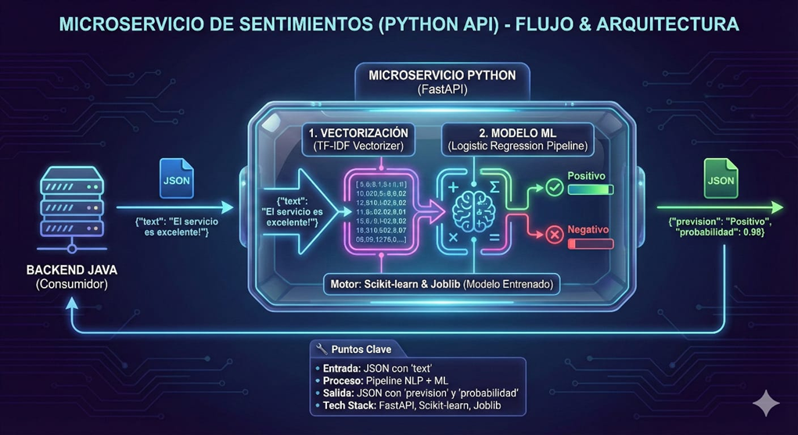
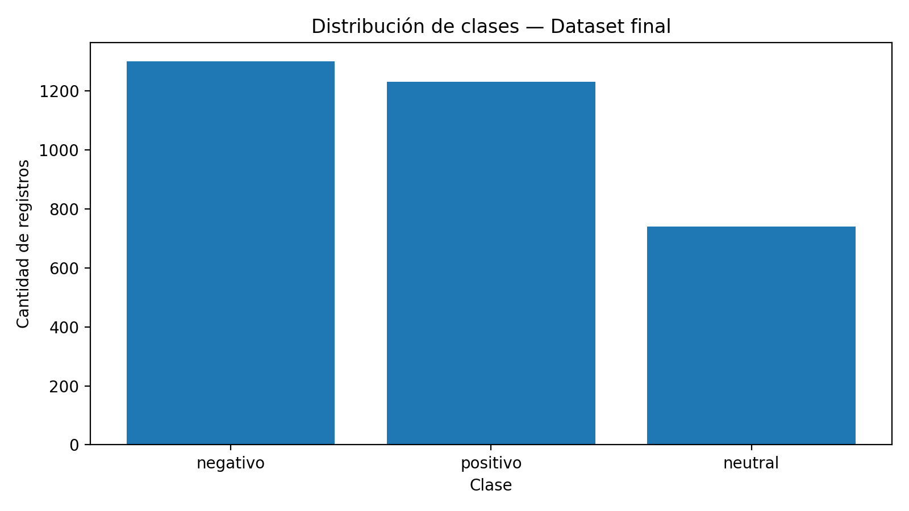
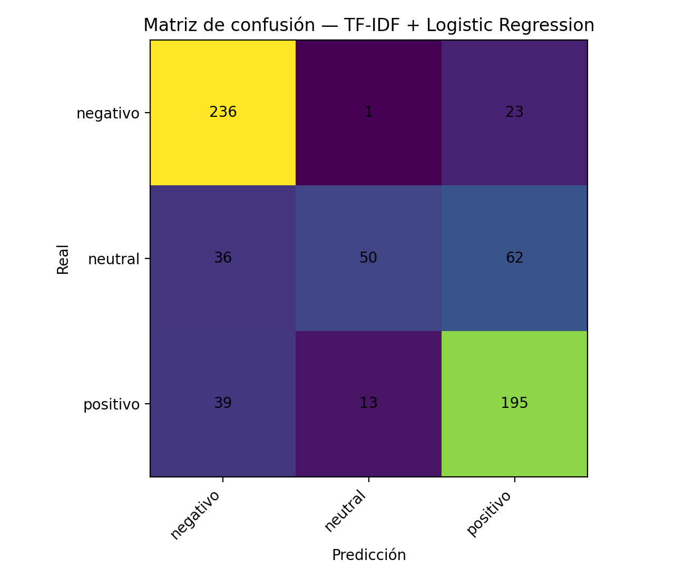

# 🧠 SentimentAPI — Data Science MVP
> **Hackathon ONE | Equipo Data Science**

**SentimentAPI** es un microservicio inteligente que clasifica el feedback de usuarios (reseñas, comentarios, encuestas) y devuelve una predicción de sentimiento consumible vía API REST.

---

## 📋 Tabla de Contenidos
- [Equipo y Roles](#-equipo-y-roles)
- [Descripción General](#-descripción-general)
- [Arquitectura y Flujo](#-arquitectura-y-flujo)
- [Datasets y Diccionario de Datos](#-datasets-y-diccionario-de-datos)
- [Pipeline de Procesamiento](#-pipeline-de-procesamiento)
- [QA y Testing (Resultados)](#-qa-y-testing-calidad-y-reproducibilidad)
- [Uso de la API](#-uso-de-la-api)
- [Instalación y Ejecución](#-instalación-y-ejecución)

---

## 👥 Equipo y Roles

| Rol | Miembro |
| :--- | :--- |
| **Líder de Integración (Java/DS)** | Eduardo |
| **Especialista NLP** | Marely |
| **Científico/a de ML** | Alex |
| **Data QA & Documentation** | Agustin |

---

## 📖 Descripción General

Este proyecto implementa un pipeline de **Natural Language Processing (NLP)** supervisado. El objetivo es recibir texto crudo desde un Back-end (Java) y retornar:
1.  **Predicción:** `Positivo`, `Neutral` o `Negativo`.
2.  **Probabilidad:** Score de confianza del modelo.

### Objetivos de Data Science
* ✅ **Dataset:** Limpieza y etiquetado para entrenamiento supervisado.
* ✅ **Pipeline:** Normalización de texto y vectorización reproducible.
* ✅ **Modelo:** Entrenamiento de modelo base (TF-IDF + Logistic Regression).
* ✅ **QA:** Evidencia de calidad y pruebas de estrés de datos.

---

## 🏗 Arquitectura y Flujo

El Back-end envía un JSON con el campo `text`. El microservicio en Python procesa, clasifica y responde.

*Figura 1. Microservicio de sentimientos (Python API) — Flujo y arquitectura.*

**Tech Stack:**
* **Entrada:** JSON.
* **Motor:** `scikit-learn`, `joblib`, `pandas`.
* **API:** `FastAPI`, `uvicorn`.

---

## 💾 Datasets y Diccionario de Datos

Se utilizan dos datasets principales en el flujo de trabajo:

### 1. Dataset Final (`dataset_listo_para_ML.csv`)
*Dataset limpio utilizado para el entrenamiento del modelo.*

✅ **Dataset actual en uso (v2):** `dataset_listo_para_ML (2).csv`  
Recomendación: renombrarlo en el repo a **`dataset_listo_para_ML.csv`** para estandarizar.

**Resumen (v2):**
- **Registros:** **3272**
- **Duplicados (por texto):** **424 (12.96%)**
- **Distribución:** `negativo` 39.73% | `positivo` 37.62% | `neutral` 22.65%

| Variable | Tipo | Descripción |
| :--- | :--- | :--- |
| `Texto_Limpio` | String | Texto preprocesado según reglas del pipeline (puede conservar mayúsculas y caracteres no-ASCII para capturar intensidad/emoción). |
| `Sentimiento_Final` | String | Target: `Positivo`, `Neutral`, `Negativo` *(en el CSV v2 viene en minúscula: `positivo`, `neutral`, `negativo`)*. |

### 2. Dataset Crudo (`sentimentdataset_es.csv`)
*Contiene 15 columnas originales incluyendo `Timestamp`, `User`, `Platform`, `Hashtags`, etc.*

---

## ⚙️ Pipeline de Procesamiento

El notebook `Procesamiento_y_Clasificacion_de_Datos_SentimentAPI.ipynb` ejecuta las siguientes transformaciones:

1.  **Carga y Selección:** Extracción de columnas `Text` y `Sentiment`.
2.  **Limpieza:**
    * Normalización y corrección de problemas de **encoding** (dataset exportado desde Excel → CSV).
    * Limpieza de ruido común (espacios/formatos) y estandarización para entrenamiento.
    * *Decisión de diseño (v2):* se evita forzar todo a minúsculas para conservar **intensidad emocional** (ej. “GENIAL”, “HORRIBLE”) cuando aporta señal.
3.  **Categorización:** Mapeo de emociones complejas a las 3 clases base.
    * *Nota:* Sentimientos ambiguos no mapeados se asignan a `Neutral` (Regla de negocio MVP).

> 🔎 Hallazgo dataset v2: aún existen registros con `#/@` y URLs en una fracción del dataset.
> Se documenta en QA como punto de mejora (según el objetivo del MVP).

---

## 🧪 QA y Testing (Calidad y Reproducibilidad)

### 6.A Testing de Datos (ETL)
Validamos que el dataset final sea íntegro y consistente antes del entrenamiento.

* **Integridad:** 0 nulos en columnas críticas, sin pérdida de registros.
* **Duplicados:** Se detectaron **424 duplicados (12.96%)** por texto.
  *Decisión sugerida:* conservarlos (refuerzan frases comunes) o deduplicar (reduce sesgo). Queda explicitado como criterio de QA.
* **Distribución de Clases:**

*Figura 2. Distribución de clases (dataset v2): Negativo (39.73%), Positivo (37.62%), Neutral (22.65%).*

**Problemas y resoluciones (Dataset):**
- **Incidente de encoding (Excel → CSV):** se detectó “mojibake”/caracteres corruptos al importar el dataset desde Excel.
  **Resolución:** exportación a CSV y normalización del encoding antes de integrar al pipeline.

### 6.B Testing de Machine Learning
**Modelo:** Pipeline `TF-IDF Vectorizer` + `Logistic Regression`.

> ⚠️ Métricas recalculadas con el **dataset v2** (`dataset_listo_para_ML (2).csv`), split estratificado 80/20 (`random_state=42`).

| Métrica | Valor (Holdout 20%) |
| :--- | :--- |
| **Accuracy** | **0.6840** |
| **F1 Macro** | **0.6440** |
| **F1 Weighted** | **0.6705** |

**Matriz de Confusión:**

*Figura 3. Matriz de confusión (dataset v2). La clase 'Neutral' es la más difícil (Recall ≈ 0.365).*

**Validación Cruzada (5-Fold):**
El modelo demuestra estabilidad con un F1 Macro promedio de **0.6580 ± 0.0101**.

---

## 🔌 Uso de la API

### Endpoint: `/sentiment`

**Request (JSON):**
json
{
  "text": "El servicio fue excelente y muy rápido"
}

**Response OK (200):**
JSON
{
  "prevision": "Positivo",
  "probabilidad": 0.87
}

**Response Error:**
JSON
{
  "error": "El campo 'text' es obligatorio y debe tener al menos 3 caracteres."
}

🚀 Instalación y Ejecución
Requisitos:
- Python 3.10+
- Librerías: pandas, scikit-learn, joblib, fastapi, uvicorn, python-multipart.

Pasos
1) Clonar el repositorio
git clone https://github.com/AgusLopez50/sentiment-api.git
cd sentiment-api

2) Instalar dependencias
pip install -r requirements.txt

3) Entrenar el modelo (Opcional si ya tienes el .joblib)
- Ejecutar el notebook ModeloSentimentAPI.ipynb para generar modelo_entrenado.joblib.

4) Levantar la API
uvicorn main:app --reload

Fecha de actualización: 2026-01-05

